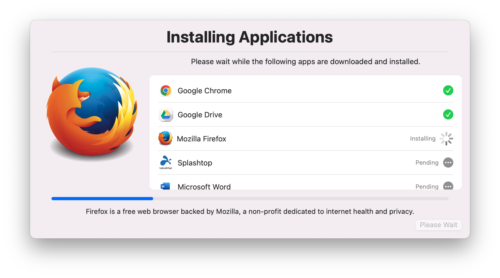

# Setup your Mac with Swift Dialog and Installomator
_Leverages [swiftDialog](https://github.com/bartreardon/swiftDialog) v1.11.2 (or later) and [Installomator](https://github.com/Installomator/Installomator) to do initial Mac setup_

## Installs Initial required software and other important configuration via Installomator
- Splashtop, Crowdstrike, and Nextiva require local files all others are pulled and installed from the internet
- automatically installs Installomator and Swift Dialog
- requires [Mac Admins python](https://github.com/macadmins/python) or other with Requests module 

